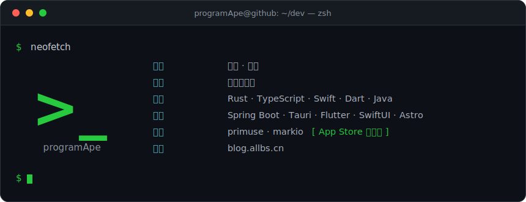
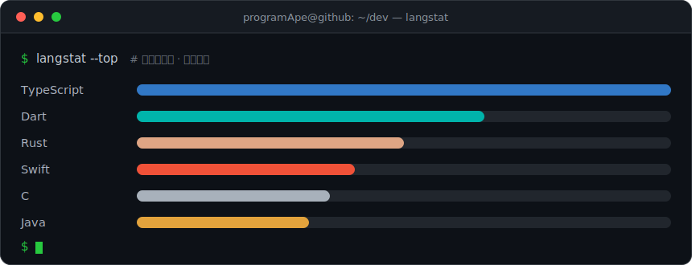

<!-- ============================== hero ============================== -->

 

<!-- ============================ app store ============================ -->

## ❯ 应用商店

<table>
<tr>
<td width="50%" valign="top">

<b>primuse</b> &nbsp;<code>猿音</code> &nbsp;·&nbsp; iOS 音乐播放器

横跨 NAS / WebDAV / 各类云盘的统一播放器——元数据刮削、歌词、
CarPlay。开源，已上架 App Store。

&nbsp;

</td>
<td width="50%" valign="top">

<b>markio</b> &nbsp;·&nbsp; macOS Markdown 阅读器

Markdown 阅读 / 文档浏览；AI 辅助笔记检索，把零散笔记沉淀为
本地知识库。开源，已上架 Mac App Store。

&nbsp;

</td>
</tr>
</table>

<!-- ============================== stack ============================== -->

## ❯ 技术栈

<!-- ============================= projects ============================= -->

## ❯ 开源项目

| 仓库 | Star | 语言 | 简介 |
| :--- | :--- | :--- | :--- |
| [`my-nas`](https://github.com/chenqi92/my-nas) |  | Dart | NAS / WebDAV / SMB 媒体聚合成海报墙，全平台 |
| [`allbs-excel`](https://github.com/chenqi92/allbs-excel) |  | Java | 基于注解的 Excel 导入导出：嵌套、合并、脱敏、图表 |
| [`delier-helper`](https://github.com/chenqi92/delier-helper) |  | JS | 交付工具箱：著作权源码 + API / 库 / 规范文档，AI 辅助 |
| [`poi-collector`](https://github.com/chenqi92/poi-collector) |  | TS | 多地图 POI / 瓦片 / 水深 / 边界数据采集 |
| [`Pier-X`](https://github.com/chenqi92/Pier-X) |  | TS | 通过 SSH 隧道驱动 DB / Web / 防火墙 / SFTP 的终端 |
| [`protoforge`](https://github.com/chenqi92/protoforge) |  | Rust | 离线接口测试：HTTP / WS / SSE / MQTT / TCP / UDP / 抓包 / 压测 |
| [`inflowave`](https://github.com/chenqi92/inflowave) |  | TS | InfluxDB 1/2/3、IoTDB、MinIO 客户端，多平台构建 |
| [`NanoLink`](https://github.com/chenqi92/NanoLink) |  | Rust | 轻量跨平台服务器监控，Rust agent + 多语言 SDK |

<a href="https://github.com/chenqi92?tab=repositories&sort=stargazers">❯ ls --all ~/projects</a>

<!-- ============================== stats ============================== -->

## ❯ 数据统计

<!-- 终端风格统计卡片，数据来自 GitHub 公开接口 -->

<!-- ============================ contributions ======================== -->

## ❯ 贡献热力图

<!-- 由 .github/workflows/snake.yml 生成，推送到 output 分支（跨分支引用，需用绝对 raw 地址） -->
<picture>
  <source media="(prefers-color-scheme: dark)" srcset="https://raw.githubusercontent.com/chenqi92/chenqi92/output/github-contribution-grid-snake-dark.svg" />
  <source media="(prefers-color-scheme: light)" srcset="https://raw.githubusercontent.com/chenqi92/chenqi92/output/github-contribution-grid-snake.svg" />
  
</picture>

