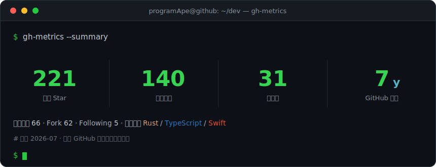

<!-- =============================== header =============================== -->

 

<!-- =============================== neofetch ============================= -->

## `$ neofetch`

<pre>
 programApe@github
 ──────────────────────────────────────────────────────────
  role        full-stack developer
  location    Nanjing, China
  languages   Rust · TypeScript · Swift · Dart · Java · C · Python
  frontend    Vue · Tauri · Flutter · SwiftUI · Astro
  backend     Spring Boot · MyBatis-Plus · XXL-JOB
  infra       InfluxDB · IoTDB · MinIO · Docker
  apps        primuse (猿音) · markio   ->  live on the App Store
  blog        <a href="https://blog.allbs.cn">blog.allbs.cn</a>
</pre>

<!-- ============================= app store ============================= -->

## `$ app-store --list-published`

<table>
<tr>
<td width="50%" valign="top">

<b>primuse</b> &nbsp;<code>猿音</code> &nbsp;·&nbsp; iOS music

Unified player across NAS / WebDAV / cloud sources, with metadata
scraping, lyrics and CarPlay. Open source, published on the App Store.

&nbsp;

</td>
<td width="50%" valign="top">

<b>markio</b> &nbsp;·&nbsp; macOS markdown reader

Markdown reader / document browser; AI-assisted note search that turns
notes into a local knowledge base. Open source, on the Mac App Store.

&nbsp;

</td>
</tr>
</table>

<!-- ============================= projects ============================= -->

## `$ ls -la ~/projects`

| repo | stars | stack | description |
| :--- | :--- | :--- | :--- |
| [`my-nas`](https://github.com/chenqi92/my-nas) |  | Dart | NAS / WebDAV / SMB media aggregated into a poster wall, all platforms |
| [`allbs-excel`](https://github.com/chenqi92/allbs-excel) |  | Java | Annotation-based Excel import/export: nesting, merge, masking, charts |
| [`delier-helper`](https://github.com/chenqi92/delier-helper) |  | JS | Delivery toolkit: copyright code + API / DB / spec docs, AI assisted |
| [`poi-collector`](https://github.com/chenqi92/poi-collector) |  | TS | Multi-map POI / tiles / bathymetry / boundary data collector |
| [`Pier-X`](https://github.com/chenqi92/Pier-X) |  | TS | Terminal that drives DB / web / firewall / SFTP over an SSH tunnel |
| [`protoforge`](https://github.com/chenqi92/protoforge) |  | Rust | Offline API tester: HTTP / WS / SSE / MQTT / TCP / UDP / capture / load |
| [`inflowave`](https://github.com/chenqi92/inflowave) |  | TS | Client for InfluxDB 1/2/3, IoTDB and MinIO, multi-platform builds |
| [`NanoLink`](https://github.com/chenqi92/NanoLink) |  | Rust | Lightweight cross-platform server monitoring, Rust agent + SDKs |

<a href="https://github.com/chenqi92?tab=repositories&sort=stargazers">$ ls --all ~/projects</a>

<!-- ============================== stats =============================== -->

## `$ git stats`

<!-- generated by .github/workflows/metrics.yml (terminal template), committed to metrics/ -->

<!-- ============================== snake ============================== -->

## `$ ./snake.sh`

<!-- generated by .github/workflows/snake.yml, pushed to the output branch -->
<picture>
  <source media="(prefers-color-scheme: dark)" srcset="https://raw.githubusercontent.com/chenqi92/chenqi92/output/github-contribution-grid-snake-dark.svg" />
  <source media="(prefers-color-scheme: light)" srcset="https://raw.githubusercontent.com/chenqi92/chenqi92/output/github-contribution-grid-snake.svg" />
  
</picture>

<code>$ exit</code> &nbsp; — thanks for visiting
